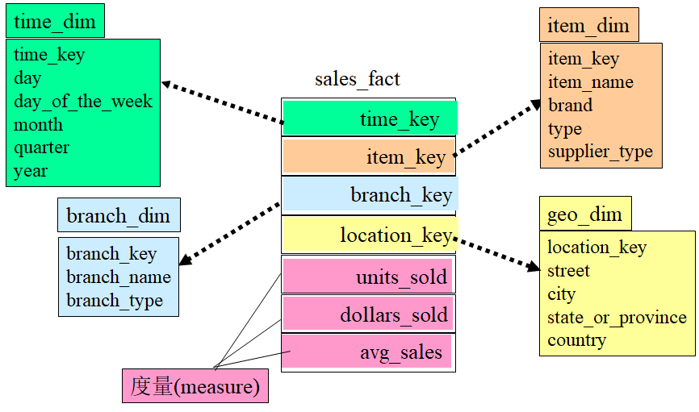

# 数据仓库原理

## 数据仓库系统结构

###  数据库与数据仓库对比

| **数据库**       | **数据仓库**     |
| ---------------- | ---------------- |
| 细节的           | 综合或提炼的     |
| 在存取时准确的   | 代表过去的数据   |
| 可更新的         | 不更新           |
| 一次操作数据量小 | 一次操作数据量大 |
| 面向应用         | 面向分析         |
| 支持管理         | 支持决策         |
| 用于事务处理     | 主要用于分析数据 |

### 数据仓库与数据库的区别

本质上主要为异构和同构的差别


事务型数据库（操作型）：TP事务处理，以写为主

分析型数据库：AP分析处理，以读为主


###  DW、ODS、DM属性

| **DW**（数据仓库）（侧重于计算能力） | ODS（操作型数据存储）（能够实时报表分析） |
| ------------------------------------ | ----------------------------------------- |
| A、面向主题的                        | A、面向主题的                             |
| B、集成的                            | B、集成的                                 |
| C、时变的                            | C、当前的                                 |
| D、非易失的/稳定的                   | D、易失的                                 |


### DM（数据集市）

（Data Mart）

1、独立的数据集市   

2、从属的数据集市：

- 面向部门的数据仓库 


- 为满足用户特定需求而创建的数据仓库


- 数据仓库的子集

### Data Lake（数据湖）

（侧重于数据存储能力）

A、 保存原始的、细节的数据

B、 结构化数据、非结构化数据均存在（多模态）

### 发展趋势

1、 一体化：比如湖仓一体（Lakehouse）：融合了数据湖的存储能力和数据仓库的计算能力

2、多模态：既能处理关系表数据，也能处理时序数据、图数据

3、云原生：数据库迁移到云上（提升数据库存储和计算的拓展性）


## 数据仓库的数据模型

### 数据仓库模型和数据库模型对比

| **数据仓库模型**                                             |
| ------------------------------------------------------------ |
| **A**、概念模型：分析主题（边界、主题、维度、类别、指标、事实） |
| **B**、逻辑模型：星型模型、雪花模型、星座模型                |
| **C**、物理模型：                                            |

| **数据库模型**                                |
| --------------------------------------------- |
| **A、**概念模型：ER（实体关系模型）           |
| **B**、逻辑模型：关系模型、网状模型、层次模型 |
| **C**、物理模型：                             |

### 数据仓库模型

销售分析的概念模型

信息包：    <u>销售分析</u>  

| 日期                                                   | 销售地点     | 销售产品     | 年龄组别    | 性别        |
| ------------------------------------------------------ | ------------ | ------------ | ----------- | ----------- |
| 年（10）                                               | 国家（15）   | 产品类（6）  | 年龄组（8） | 性别组（2） |
| 季度（40）                                             | 区域（45）   | 产品组（48） |             |             |
| 月（120）                                              | 城市（280）  | 产品（240）  |             |             |
|                                                        | 区（880）    |              |             |             |
|                                                        | 商店（2000） |              |             |             |
| **度量和事实：**  **预测销售量、实际销售量、预测误差** |              |              |             |             |


销售分析的逻辑模型（星型模型）


## 数据抽取、转换和装载

### ETL

（Extraction、Transformation、Loading）

数据抽取、数据清洗、数据转换、数据加载、数据更新。

数据更新：

- 全量更新：数据库建立时期
- 增量更新：数据库维护

## 元数据

用来描述数据的数据，包含业务元数据和技术元数据


## 例题



### 销售质量

```sql
select sum(units_sold) from sales_fact;
```

### 不同年份的销售量

```sql
select sum(units_sold) from sales_fact
join time_dim on sales_fact.time_key = time_dim.time_key
group by time_dim.year;
```

### 不同年份不同商品项的销售额

```sql
select city as 城市,item_names as 商品项,sum(dollars_sold) as 销售额
from sales_fact a
inner join geo_dim b
on a.location_key = b.location_key
inner join item_dim c
on a.item_key = c.item_key
group by b.city,c.item_name;
```

### 2021年1~8月份各月平均销售

```sql
select sum(avg_sales) from sales_fact a
join time_dim b on a.time_key = b.time_key
where mouth >= 1 and mouth <= 8;
```
