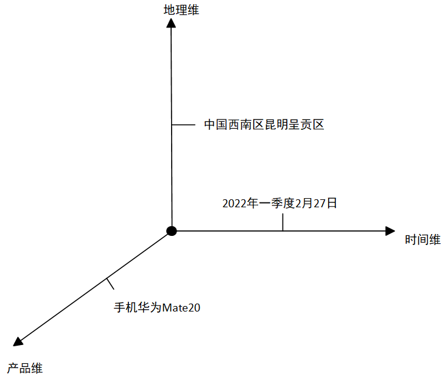
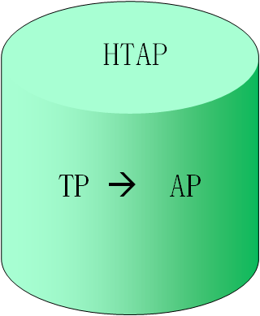
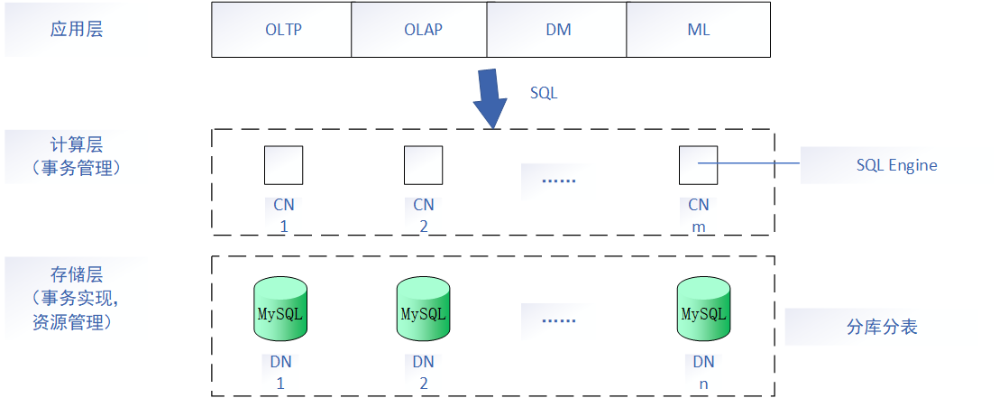
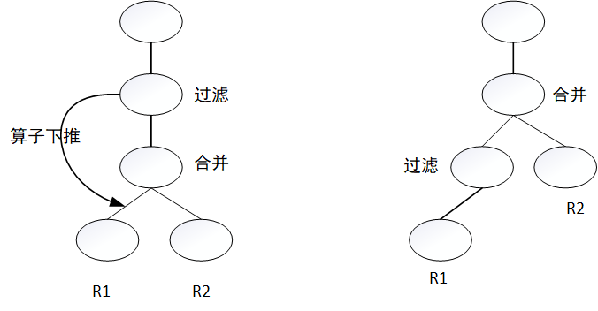
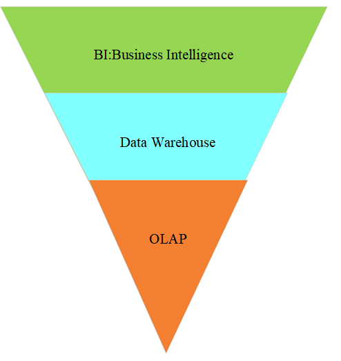
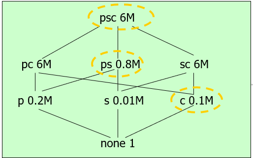
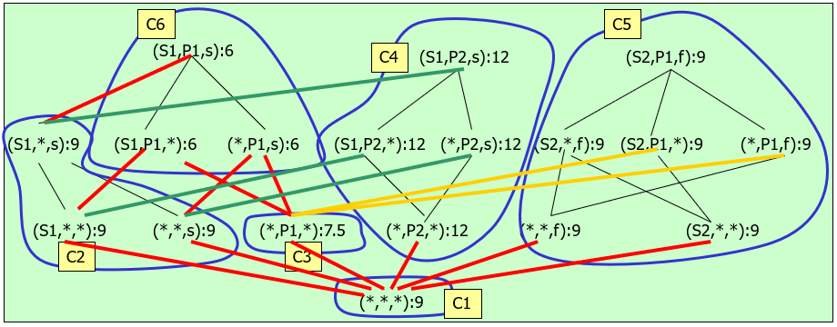
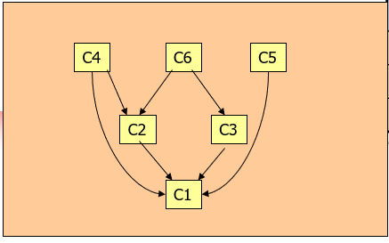

# 联机分析处理

## OLAP的概念

### 联机分析处理（OLAP）

A、交互性：联机

B、维（dimension）：分析数据的角度 

立方体（超过三维的立方体称为超立方体或多维空间）

### 维的层次（hierarchy）

例.时间维：       

​       年-季度-月-天

​       年-学期-周   （每一层称为 **级别（level）**）

### 维的成员（member）

维的一个取值

### 多维数组（多维空间）

维和度量的组合



### 数据单元（单元格）

多维数组的一个取值

如果查询结果保存起来，则称该查询视图物化


## OLAP的多维数据分析

### 多维分析

#### 切片（slice）/切块（dice）

切片：单个维度分析

切块：两个或以上维度分析


#### 钻取

向下钻取（Drill-down）下钻：粗粒度----->细粒度分析

向上钻取（Roll-up）上卷：细粒度----->粗粒度分析


#### 旋转（pivot）

不同维度的置换

求不同城市的总销售量

```sql
select sum(sale_unit) from sale
join time on time.Q = sale.Q
join city on city.C = sale.C
group by city.C;
```


## OLAP的存储模型

### OLAP实现架构

ROLAP：关系表 ----->存储空间更小

MOLAP：多维数组----->查询效率高

Eg.sale(产品)(季度)(城市)------->value

| 产品 | 季度 | 城市 | value |
| :--: | :--: | :--: | :---: |
|  TV  |  Q1  | 北京 |       |
|  CD  |  Q2  | 上海 |       |
|  PC  |  Q3  | 广州 |       |
| ALL  | ALL  | ALL  |       |


实现框架：

1、<u>R</u>OLAP：基于关系表，存储空间效率高，利用关系数据库特性

​      Relational

2、<u>M</u>OLAP：基于多维数组，查询效率高

​      Multi-dimensional

3、<u>H</u>OLAP：包含综合数据（MOLAP）和详细数据（ROLAP）

​      Hybrid

## HTAP

事务型数据库：OLTP，以写为主，行存

分析型数据库：OLAP，以读为主，列存

混合事务分析型数据库：HTAP

- TP、AP资源物理分离
- TP、AP数据一致性：
  - 强一致性
  - 弱一致性



## 国产数据库示例

### PolarDB-X数据库

结构框架：



### 下推



### BI




## 数据立方体和商立方体

### 物化视图选择

#### Greedy Algorithm(贪心算法)

- k = number of views to be materialized

- Given

  - v is a view

  - S is a set of views which are selected to be materialized

- Define the benefit of selecting v for materialization as

  - B(v, S) = Gain(S U v, S) 

- S <--{top view};

- For i = 1 to k do 

  - Select that view v not in S such that B(v, S) is maximized;

  - S <-- S U {v}

- Resulting S is the greedy selection



|      |   1st Choice(M)   |    2nd Choice(M)    |
| :--: | :---------------: | :-----------------: |
|  pc  |    (6-6)*3 = 0    |     (6-6)*2 = 0     |
|  ps  | (6-0.8)*3 = 15.6  |                     |
|  sc  |    (6-6)*3 = 0    |     (6-6)*2 = 0     |
|  p   |  (6-0.2)*1 = 5.8  |   (0.8-0.2)*1=0.6   |
|  s   | (6-0.01)*1 = 5.99 | (0.8-0.01)*1 = 0.79 |
|  c   |  (6-0.1)*1 = 5.9  |   (6-0.1)*1 = 5.9   |

Two views to be materialized are

1、ps     2、c

V = {ps, c}

Gain(V U {top view}, {top view})

= 15.6 + 5.9 = 21.5


### 数据立方体




### 商立方体




## 习题讲解

数据转换一般可以分为：

- 工具转换

- 人工转换

事实表的特点：

- 数据量大
- 表中行数多
- 表中数据常进行追加

数据集市的特点：

- 主题少
- 数据少
- 建设周期短
- 风险小
