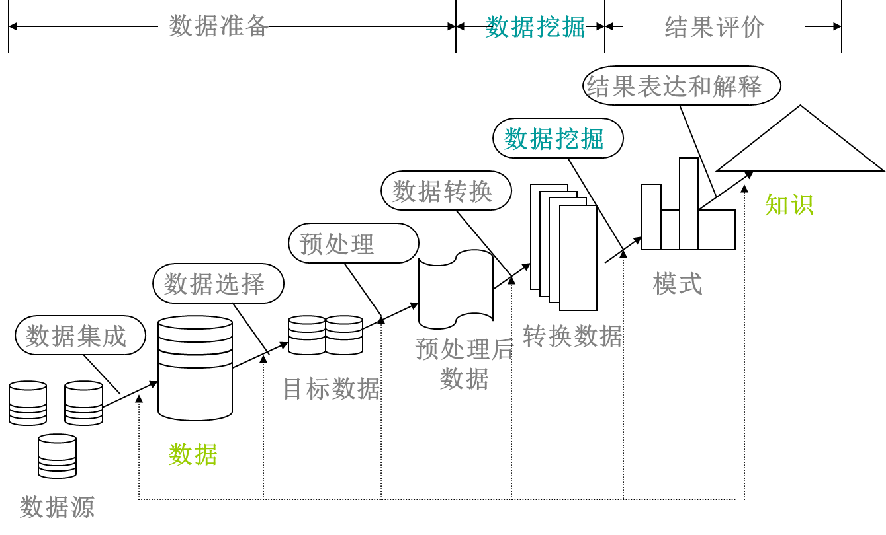

# 数据挖掘原理

## 知识发现过程

### 知识发现过程定义

- 知识发现（KDD）：从数据中发现有用知识的整个过程。

- 数据挖掘（DM） ：KDD过程中的一个特定步骤，它用专门算法从数据中抽取模式。

## 数据挖掘方法和技术概述

### 数据挖掘常用技术

- 关联分析

- 分类

- 聚类

- 人工神经网络等

### 关联分析

若两个或多个数据项的取值之间重复出现且概率很高时，它就存在某种关联，可以建立起这些数据项的关联规则。

一般用“支持度”和“可信度”两个阈值来淘汰无用的关联规则。

### 数据挖掘工具

- SAS Enterprise Miner
- SPSS Clementine 
- IBM Intelligent Miner 
- Oracle Data Miner
- SSAS、SSIS、SSRS

