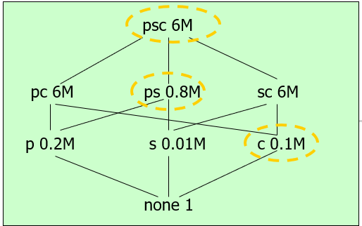
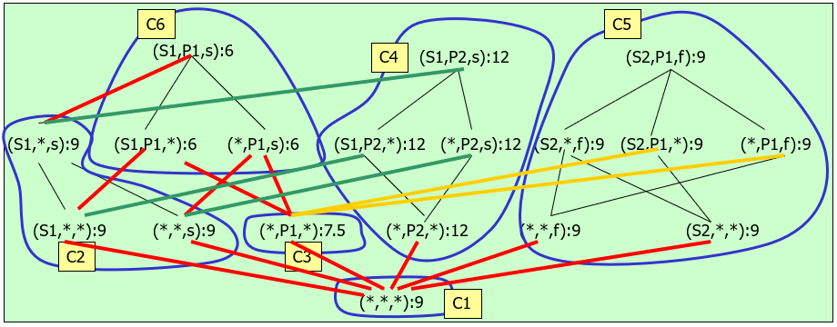
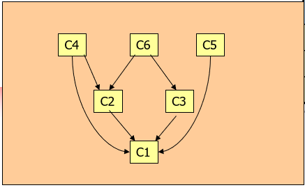
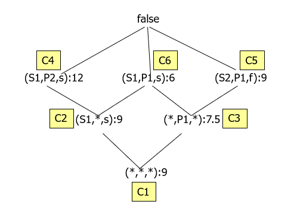

# 数据立方体和商立方体

## 物化视图选择

### Greedy Algorithm(贪心算法)

- k = number of views to be materialized

- Given

  - v is a view

  - S is a set of views which are selected to be materialized

- Define the benefit of selecting v for materialization as

  - B(v, S) = Gain(S U v, S) 

- S <--{top view};

- For i = 1 to k do 

  - Select that view v not in S such that B(v, S) is maximized;

  - S <-- S U {v}

- Resulting S is the greedy selection

|      |   1st Choice(M)   |    2nd Choice(M)    |
| :--: | :---------------: | :-----------------: |
|  pc  |    (6-6)*3 = 0    |     (6-6)*2 = 0     |
|  ps  | (6-0.8)*3 = 15.6  |                     |
|  sc  |    (6-6)*3 = 0    |     (6-6)*2 = 0     |
|  p   |  (6-0.2)*1 = 5.8  |   (0.8-0.2)*1=0.6   |
|  s   | (6-0.01)*1 = 5.99 | (0.8-0.01)*1 = 0.79 |
|  c   |  (6-0.1)*1 = 5.9  |   (6-0.1)*1 = 5.9   |

Two views to be materialized are

1、ps     2、c

V = {ps, c}

Gain(V U {top view}, {top view})

= 15.6 + 5.9 = 21.5

## 数据立方体

## 商立方体

