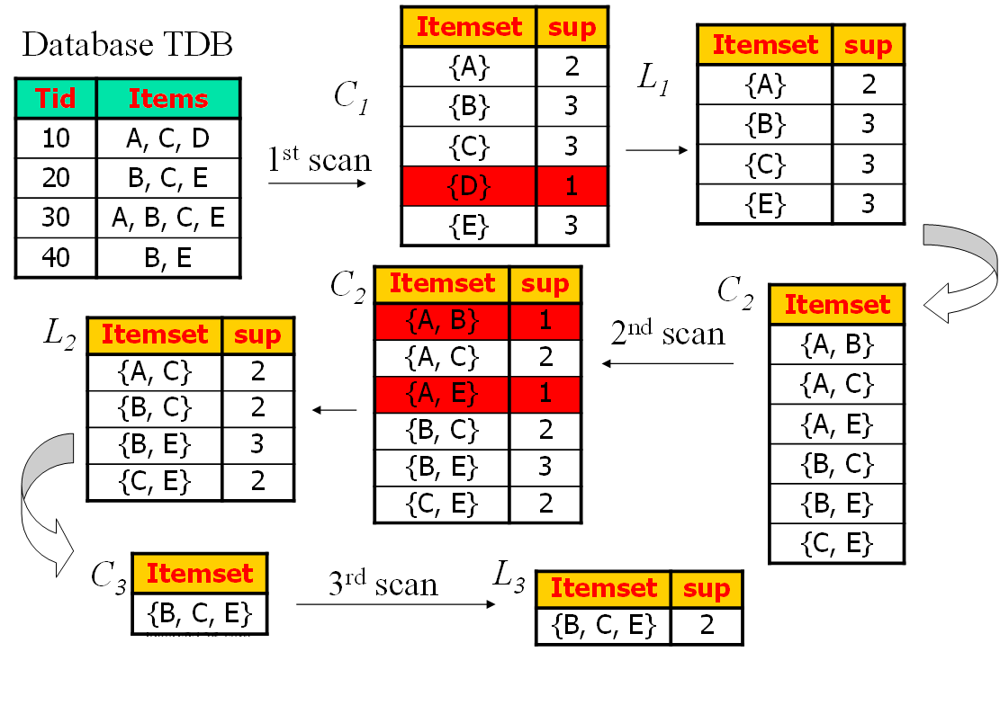

# 关联规则

## 关联规则的挖掘原理

### 相关概念

#### 项集（Itemset）

项（Item）的集合

#### 关联规则

$$
A\subseteq I，B\subseteq I，A\cap B=\Phi，则A\to B称为关联规则
$$

#### 支持度（supp)

$$
S(A\to B)=P(AB)=\frac{|AB|}{|D|}
$$

其中，|D|表示事务数据库D的事务个数

#### 置信度（conf）

$$
C(A\to B)=P(B|A)=\frac{|AB|}{|A|}
$$

其中，|A|表示数据库中包含项集A的事务个数

#### 阈值

- 最小支持度（min_supp)
- 最小置信度（min_conf)

#### 频繁项集（Frequent Itemset）

项集满足最小支持度，即：
$$
S(A\to B)\ge min.supp
$$
性质：

- 频繁项集的子集必是频繁项集
- 非频繁项集的超集一定是非频繁的

#### 强关联规则

同时满足最小支持度（min_supp）和最小置信度（min_conf）的规则称之为强关联规则，即
$$
给定事务数据库D，满足A\subseteq I,B\subseteq I,A\cap B=\Phi,以及S(A\to B)\ge min.supp且C(A\to B)\ge min.conf
$$

## Apriori算法

min_supp=2

