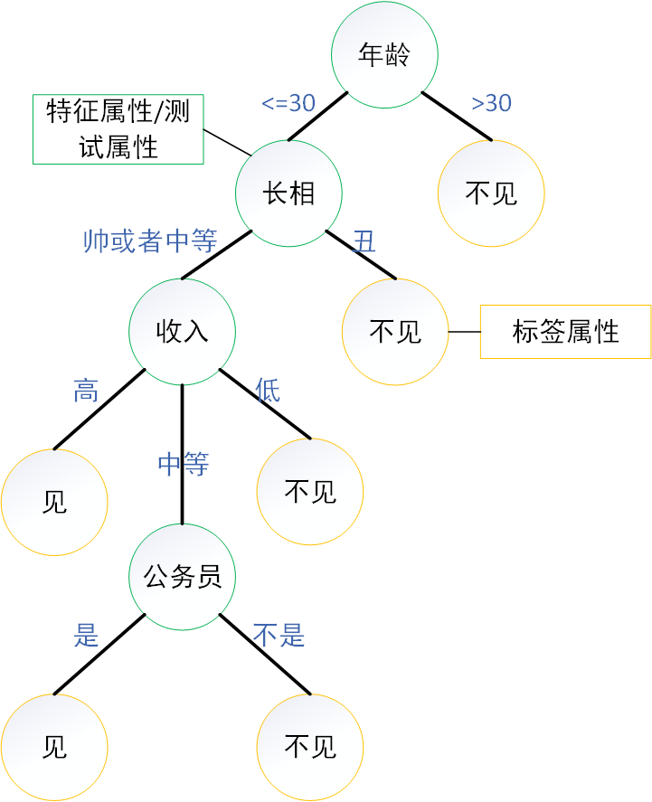

# 决策树

## 决策树分类

### 决策树的概念

是一种类似于流程图的树结构

- 其中，每个内部结点表示在一个属性上的测试，每个分枝代表一个测试输出

- 每个树叶结点存放一个类标签

### 实例

张（被介绍）：多大年纪了？

王（介绍）：25。

张：长的帅不帅？

王：挺帅的。

张：收入高不？

王：不算很高，中等情况。

张：是公务员不？

王：是，在税务局上班呢。

张：那好，我去见见。

## 决策树分类ID3方法

### 熵（Entropy）

信息熵
$$
I(p)=-(p_1*\log(p_1)+p_2*\log(p_2)+ ... +p_n*\log(p_n))=-\sum_{i=1}^n(p_i*\log(p_i))
$$

### 实例

| Race  | Income | Child | Insurance |
| :---: | :----: | :---: | :-------: |
| black |  high  |  no   |    yes    |
| white |  high  |  yes  |    yes    |
| white |  low   |  yes  |    yes    |
| white |  low   |  yes  |    yes    |
| black |  low   |  no   |    no     |
| black |  low   |  no   |    no     |
| black |  low   |  no   |    no     |
| white |  low   |  no   |    no     |

$$
Info(T)=- \frac{1}{2} \log(\frac{1}{2})- \frac{1}{2} \log(\frac{1}{2})=1
$$

计算Race属性
$$
Info(T_{black})=- \frac{3}{4} \log(\frac{3}{4})- \frac{1}{4} \log(\frac{1}{4})=0.8113
$$

$$
Info(T_{white})=- \frac{3}{4} \log(\frac{3}{4})- \frac{1}{4} \log(\frac{1}{4})=0.8113
$$

$$
Info(Race,T)=\frac{1}{2}*Info(T_{black})+\frac{1}{2}*Info(T_{white})=0.8113
$$

$$
Gain(Race,T)=Info(T)-Info(Race,T)=1-0.8113=0.1887
$$

计算Income属性
$$
Info(T_{high})=- 1 \log(1)- 0 \log(0)=0
$$

$$
Info(T_{low})=- \frac{1}{3} \log(\frac{1}{3})- \frac{2}{3} \log(\frac{2}{3})=0.9183
$$

$$
Info(Income,T)=\frac{1}{4}*Info(T_{high})+\frac{3}{4}*Info(T_{low})=0.6887
$$

$$
Gain(Income,T)=Info(T)-Info(Income,T)=1-0.6887=0.3113
$$

计算Child属性
$$
Info(T_{yes})=- 1 \log(1)- 0 \log(0)=0
$$

$$
Info(T_{no})=- \frac{1}{5} \log(\frac{1}{5})- \frac{4}{5} \log(\frac{4}{5})=0.7219
$$

$$
Info(Child,T)=\frac{3}{8}*Info(T_{yes})+\frac{5}{8}*Info(T_{no})=0.4512
$$

$$
Gain(Child,T)=Info(T)-Info(Child,T)=1-0.4512=0.5488
$$

选择Child属性后
$$
Info(T)=- \frac{1}{5} \log(\frac{1}{5})- \frac{4}{5} \log(\frac{4}{5})=0.7219
$$
计算Race属性
$$
Info(T_{black})=- \frac{3}{4} \log(\frac{3}{4})- \frac{1}{4} \log(\frac{1}{4})=0.8113
$$

$$
Info(T_{white})=- 0 \log(0)- 1 \log(1)=0
$$

$$
Info(Race,T)=\frac{4}{5}*Info(T_{black})+\frac{1}{5}*Info(T_{white})=0.6490
$$

$$
Gain(Race,T)=Info(T)-Info(Race,T)=0.7219-0.6490=0.0729
$$

计算Income属性
$$
Info(T_{high})=- 1 \log(1)- 0 \log(0)=0
$$

$$
Info(T_{low})=- 0 \log(0)- 1 \log(1)=0
$$

$$
Info(Income,T)=\frac{1}{5}*Info(T_{high})+\frac{4}{5}*Info(T_{low})=0
$$

$$
Gain(Income,T)=Info(T)-Info(Income,T)=0.7219-0=0.7219
$$

选择Income属性

### ID3算法缺点

- 倾向于选择更多不同属性值的特征属性
- 适合于处理离散属性，连续属性需要离散化

## CART

### Gini

$$
I(p)=1-\sum_jP_j^2
$$

