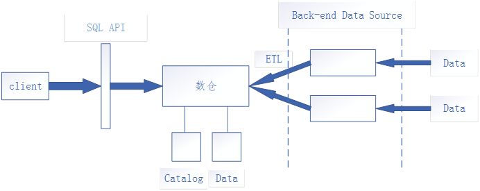
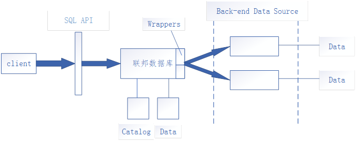

#### 数据挖掘与数据仓库_1

**1、** **数据仓库产生原因：**

A、 数据的大量积累

B、 关系数据库的局限（操作型数据库）{局限：TP（存取频率高、时间短）、AP（消耗资源）特性不同、数据集成度不高、质量问题、数据面向应用而非主题}

C、 异构数据源共享问题（各类数据库产品增加à异构环境数据增加）

##### 异构数据源解决方案

一、 数据仓库

二、联邦数据库

##### 2、**数据仓库与联邦数据库的区别：**

数据仓库：优：查询速度快   

​                   缺：空间占用大，安全性一般，实时更新一般

联邦数据库：优：隐私保护性好，空间占用小，实时更新较好

​                       缺：查询处理复杂，速度慢

##### 3、数据仓库：一个面向主题的、集成的、时变的、非易失的数据集合。

A、面向主题的：与主题相关的数据导入数据仓库，由异构转换为同构；

B、集成的：集成的主要方法：a、统一：消除不一致的现象（数据清洗）

​                                                     b、综合：对原有数据进行综合和计算

##### **ETL**（Extraction、Transformation、Loading）：

数据抽取、数据清洗、数据转换、数据加载、数据更新。

数据更新：全量更新：数据库建立时期

​                   增量更新：数据库维护

C、时变的：数据仓库保存长期的字段、显/隐式时间类型数据、历史数据，而操作型数据库保留当前数据。

D、非易失的：以读为主，数据相对稳定，一般不执行“更新”操作，主要分析数据。

##### **数据仓库与数据库的区别本质上主要为异构和同构的差别**

事务型数据库（操作型）：TP事务处理，以写为主

分析型数据库：AP分析处理，以读为主

