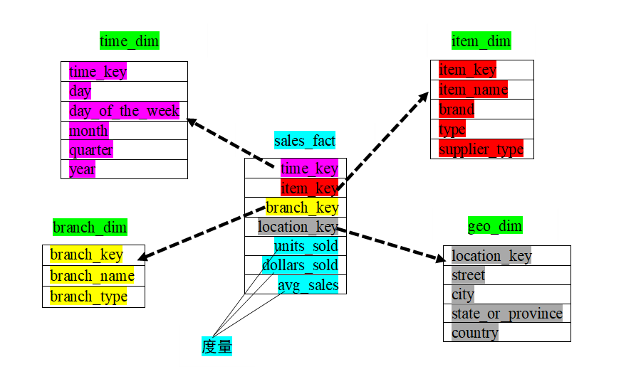

# 数据挖掘与数据仓库_3

## 例题



### SQL查询

#### 销售质量

```sql
select sum(units_sold) from sales_fact;
```

#### 不同年份的销售量

```sql
select sum(units_sold) from sales_fact
join time_dim on sales_fact.time_key = time_dim.time_key
group by time_dim.year;
```

#### 不同年份不同商品项的销售额

```sql
select city as 城市,item_names as 商品项,sum(dollars_sold) as 销售额
from sales_fact a
inner join geo_dim b
on a.location_key = b.location_key
inner join item_dim c
on a.item_key = c.item_key
group by b.city,c.item_name;
```

#### 2021年1~8月份各月平均销售

```sql
select sum(avg_sales) from sales_fact a
join time_dim b on a.time_key = b.time_key
where mouth >= 1 and mouth <= 8;
```

## 粒度

粒度：数据综合程度高低的一个度量

粒度越粗，综合程度越高，存储空间越小，回答的查询种类越多，查询效率越高；

粒度越细，综合程度越低，存储空间越大，回答的查询种类越少，查询效率越低。

年（粗）-->月-->日（细）


## 分割（分区）（partition）

划分方式：水平划分和垂直划分

分区类别：:

1、范围分区：按时间分割，按单位分割。（分布式数据库）

2、哈希分区：（polarDB-X数据库）

3、列表分区：按职业、学历分区


## 系统设计差异

| **操作型数据库** | **数据仓库**     |
| ---------------- | ---------------- |
| 面向应用         | 面向分析         |
| 确定的应用需求   | 不确定的分析需求 |
| 事务处理性能     | 数据的全局一致性 |
| 数据来自组织外部 | 数据来自系统内部 |

### 数据仓库设计原则

面向主题原则、数据驱动原则、原型法设计原则

### 数据仓库设计步骤

​           1、明确主题

​           2、概念模型设计

​           3、技术准备

​           4、逻辑模型设计

​           5、物理模型设计

​           6、数据仓库生成

​           7、数据仓库的运行与维护

### 数据仓库设计方法论

DM（数据集市） --> DW（数据仓库） （自底向上）（成本小，收益大）

DW（数据仓库） -->DM（数据集市） （自顶向下）（成本大，收益小）
