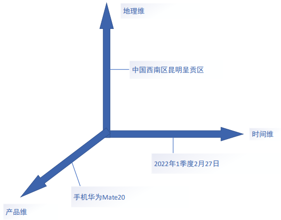

#### 数据挖掘与数据仓库_4

##### **1**、联机分析处理（OLAP）

A、交互性：联机

B、维（dimension）：分析数据的角度 à 立方体（超过三维的立方体称为超立方体或多维空间）

**a、维的层次（hierarchy）：**

例.时间维：       

​       年-季度-月-天

​       年-学期-周   （每一层称为 **级别（level）**）

**b、维的成员（member）**：维的一个取值

**c、多维数组（多维空间）**：维和度量的组合

**d、数据单元（单元格）**：多维数组的一个取值

如果查询结果保存起来，则称该查询视图物化

 **e、多维分析：**

A、切片（slice）/切块（dice）

切片：单个维度分析

切块：两个或以上维度分析

B、钻取

​     向下钻取（Drill-down）下钻：粗粒度----->细粒度分析

​     向上钻取（Roll-up）上卷：细粒度----->粗粒度分析

C、旋转（pivot）：不同维度的置换

求不同城市的总销售量

Select sum(sale-unit) from sale

Join time on time.Q=sale.Q

Join city on city.C=sale.C

Group by city.C

**f、OLAP实现架构**

ROLAP：关系表 ----->存储空间更小

MOLAP：多维数组----->查询效率高

Eg.sale(产品)(季度)(城市)------->value

​               TV     Q1    北京

​               CD    Q2    上海

​               PC     Q3    广州

​               ALL   ALL    ALL
