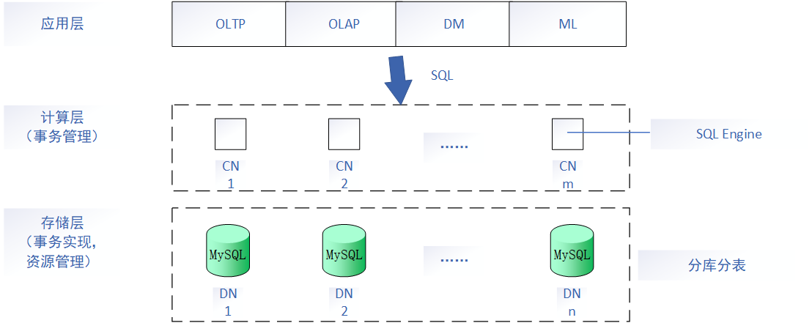

# 数据挖掘与数据仓库-5

## OLAP（联机分析处理）

实现框架：

1、<u>R</u>OLAP：基于关系表，存储空间效率高，利用关系数据库特性

​      Relational

2、<u>M</u>OLAP：基于多维数组，查询效率高

​      Multi-dimensional

3、<u>H</u>OLAP：包含综合数据（MOLAP）和详细数据（ROLAP）

​      Hybrid

事务型数据库：OLTP，以写为主，行存

分析型数据库：OLAP，以读为主，列存

混合事务分析型数据库：HTAP

## PolarDB-X数据库

结构框架：

## 下推

## BI

